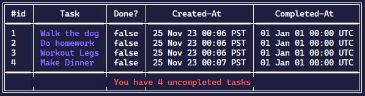

# CLI Todo App

### Overview


This is a CLI Todo Application that was made using Golang. The application utilizes [SimpleTables](https://github.com/alexeyco/simpletable) to display a beautiful list of todo items. 

### Usage
To use the application you must run the application using one of the following flags below as a way to interact with the application. The application stores your todos within a `todos.json` file.

### Flags
```
-add <Task>
    Add the task to the bottom of your todo list

-complete <Task ID#>
    Completes the task according to the todo ID# within the list.

-delete <Task ID#>
    Removes the task according to the todo ID# within the list.

-list
    Lists your todo list within the CLI
```

### Build
To build from source, enter the `Src` directory and run `make` to have go build the application within the `bin` directory.